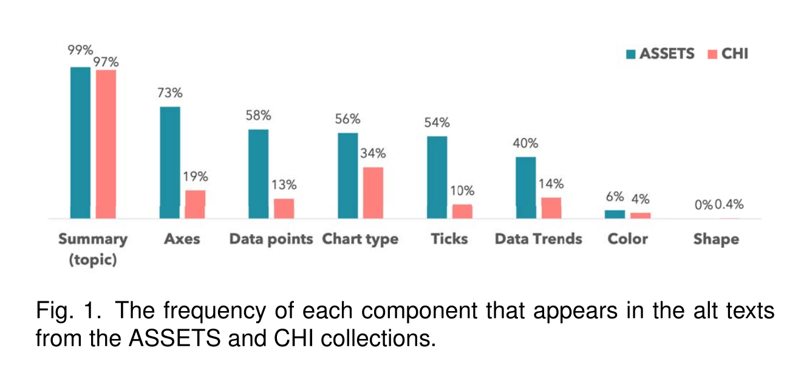
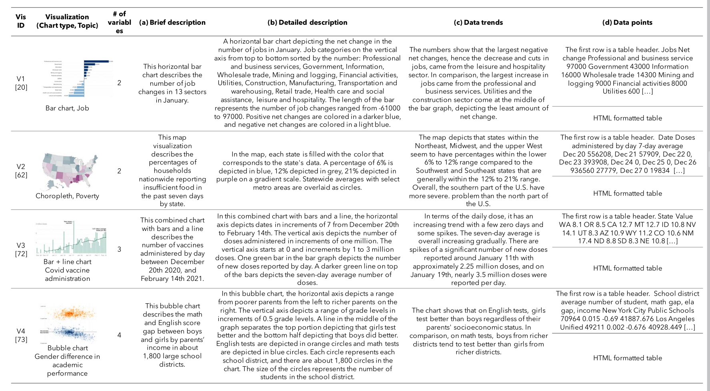

---
# try also 'default' to start simple
theme: seriph
# random image from a curated Unsplash collection by Anthony
# like them? see https://unsplash.com/collections/94734566/slidev
background: /images/main.jpg
# apply any windi css classes to the current slide
class: 'text-center'
# https://sli.dev/custom/highlighters.html
highlighter: shiki
# show line numbers in code blocks
lineNumbers: false
# persist drawings in exports and build
drawings:
  persist: false
---

# Communicating Visualizations without Visuals
<!--
Communicating Visualizations without Visuals: Investigation of Visualization Alternative Text for People with Visual Impairments

Accessible Visualization via Natural Language Descriptions: A Four-Level Model of Semantic content
-->
Investigation of Visualization Alternative Text for People with Visual Impairments

<div class="pt-12">
  <span @click="$slidev.nav.next" class="px-2 py-1 rounded cursor-pointer" hover="bg-white bg-opacity-10">
    Press Space for next page <carbon:arrow-right class="inline"/>
  </span>
</div>

<div class="abs-br m-6 flex gap-2">
  <button @click="$slidev.nav.openInEditor()" title="Open in Editor" class="text-xl icon-btn opacity-50 !border-none !hover:text-white">
    <carbon:edit />
  </button>
  <a href="https://github.com/slidevjs/slidev" target="_blank" alt="GitHub"
    class="text-xl icon-btn opacity-50 !border-none !hover:text-white">
    <carbon-logo-github />
  </a>
</div>

---
theme: seriph
background: /images/main.jpg
class: 'text-center'
layout: cover
---

# Communicating Visualizations without Visuals
<!--
Communicating Visualizations without Visuals: Investigation of Visualization Alternative Text for People with Visual Impairments

Accessible Visualization via Natural Language Descriptions: A Four-Level Model of Semantic content
-->
Investigation of Visualization Alternative Text for People with Visual Impairments

<div class="pt-12">
  <span @click="$slidev.nav.next" class="px-2 py-1 rounded cursor-pointer" hover="bg-white bg-opacity-10">
    Press Space for next page <carbon:arrow-right class="inline"/>
  </span>
</div>

<div class="abs-br m-6 flex gap-2">
  <button @click="$slidev.nav.openInEditor()" title="Open in Editor" class="text-xl icon-btn opacity-50 !border-none !hover:text-white">
    <carbon:edit />
  </button>
  <a href="https://github.com/slidevjs/slidev" target="_blank" alt="GitHub"
    class="text-xl icon-btn opacity-50 !border-none !hover:text-white">
    <carbon-logo-github />
  </a>
</div>

<div style="width: 100vw; height: 100vh; backdrop-filter: blur(10px); background-color: #ffffff11; position: absolute; top: 0; left: 0;"></div>

---
layout: two-cols
---

# Selection

- IEEE VIS: Visualization & Visual Analytics 2021
- Thursday, 28<sup>th</sup> October
- Accessible Visualization and Natural Language
- **Communicating Visualizations without Visuals**: Investigation of Visualization Alternative Text for People with Visual Impairments
- **Accessible Visualization via Natural Language Descriptions**: A Four-Level Model of Semantic content

::right::


<footer class="text-xs absolute bottom-0px pb-4">
Source: http://ieeevis.org/year/2021/info/papers-sessions
</footer>
---
layout: two-cols
---

# Take a look at ...


::right::


# ... and compare it to ...


---

# Context: Accessibility on the Web

- Accessibility is the practice of making your websites usable by as many people as possible.
  - hardware
  - software
  - language
  - location
  - ability

<footer class="text-xs absolute bottom-0px pb-4">
Source: https://developer.mozilla.org/en-US/docs/Learn/Accessibility/What_is_accessibility<br>
Source: https://www.w3.org/standards/webdesign/accessibility
</footer>

<!--
Und das schöne: Wir müssen uns nicht mehr fragen, ob das ein Trend ist den wir mitgehen sollten. Denn ...
-->

---
layout: quote
---

# "The power of the Web is in its universality. <br>Access by everyone regardless of disability is an essential aspect."
<span class="">

</span>

\- Tim Berners-Lee, W3C Director and inventor of the World Wide Web

<footer class="text-xs absolute bottom-0px pb-4">
Source: https://www.w3.org/standards/webdesign/accessibility
</footer>

<!--
- Test12
-->

---

# Context: Visual impairments and the internet

- 285 million people with visual impairment (39 million entirely blind)
- Increasing digitalization of physical media
- Screen readers
- Semantic HTML

<footer class="text-xs absolute bottom-0px pb-4">
Source: https://ieeexplore.ieee.org/document/9552938
</footer>

<!--
Quasi seit dem Einsatz des Internets für Forschung

Screen readers are software programs that scan the text on a screen and communicate the information to people with visual impairments via speech (some also have braille output via a braille display). Users control which components in the page the
screen reader communicates through several key combinations on the
keyboard or a touch gesture on a smartphone.
-->
---

# Research question


- Problem:
  - Summarize complex data and relation
  - Offload cognitive burden
  - Leverage visual perception
<br>

- Idea:
  - Communicating visualization through text
  - Text that replaces visualizations is called *alt text*
  - In web standard used for photos, graphics and pictograms (since 1995)
  - Adoption to visualizations of data is a challenge

<br>

=> How can we formulate alt text for visualizations to best serve people with visual impairments?


<footer class="text-xs absolute bottom-0px pb-4">
Source: https://ieeexplore.ieee.org/document/9552938
</footer>

<!--
Zusammenfassen von komplexen Daten und ihre Abhängigkeiten
Wir wollen also kognitive Hürden abbauen
indem wir visuelle Wahrnehmung ausnutzen
-->
---
layout: quote
---

# Where to use our alt texts

```html {monaco}
...

  

  <svg>
    <title>...</title>
    <desc>...</desc>
  </svg>

...
```

---

# But how?

1. **Survey and summarize existing guidelines** for the generation of visualization alt text. **Analyze current practices** to demonstrate how aligned they are with the guidelines and identify other commonly used strategies.
2. **Report findings from an interview study with 22 people with visual impairments** that provide insights into the properties of good alt texts and into the role of visualizations for people with visual impairments to support people with visual impairments in the context of reading online news.
3. **Propose actionable recommendations for generating informative alt texts** along with rationales and suggest system-level improvements (e.g., structures of HTML, multimodal integration) informed by the study to better support visualization interpretation for people with visual impairments.

<footer class="text-xs absolute bottom-0px pb-4">
Source: https://ieeexplore.ieee.org/document/9552938
</footer>
<!-- 
um zu verstehen in welchem Maß die Guidelines befolgt werden und was es für anderen Ansätze gibt, die oft von Leuten verwendet werden.
Wichtig zu erwähnen: die untersuchten alt-texte von visualisierungen stammen von Wissenschaftler:innen. ACM fordert Autor:innen auf, alt texte für Abbildungen abzugeben
-->

---

# Phase 1: Current guidelines (Method)

1. Google search with keywords (many results)
   - visualization accessibility
   - visualization alternative text
   - etc.
2. Filter for blind and low vision people (31 results)
   - remove other accessbility guidelines
   - remove guidelines for colorblindness 
3. Remove reference only guidelines (4 main guidelines)
   - [WCAG guidelines](https://www.w3.org/WAI/tutorials/images/complex/)
   - [Penn State’s accessibility guidelines](https://accessibility.psu.edu/images/charts/)
   - [Diagram Center’s guidelines](http://diagramcenter.org/specific-guidelines-e.html)
   - [CFPB’s guidelines](https://cfpb.github.io/design-system/guidelines/data-visualization-guidelines)

<footer class="text-xs absolute bottom-0px pb-4">
Source: https://ieeexplore.ieee.org/document/9552938
</footer>
---

# Phase 1: Current guidelines (Findings)

- Structure of alt text
  - Two parts (short description; long description)
  - Don't put the long description into *alt* attribute
  - Short description should describe how to access the long description
- Components in alt text
  - meaningful and informative
  - one-sentence summary of the chart, chart type, axis and labels
  - don't mention colors
  - summary of data trends
- Data tables
  - in addition to alt text
  - link to data represented in the visualization
  - use machine readable formats (i.E. CSV)

<footer class="text-xs absolute bottom-0px pb-4">
Source: https://ieeexplore.ieee.org/document/9552938
</footer>

<!--
- descriptive and meaningful
- including information on the chart type, axes, and data trends.
- Some visual attributes (e.g., color) may be omitted
- formatted tables are essential in understanding visualizations

While these guidelines provide a useful starting point, they **lack Kriterien** for why each component should or should not be included. Furthermore, the guidelines do **not reference empirical evidence** of how they support the needs of people with visual impairments.
-->

---

# Phase 2: Current practices (Method)

- Searched for samples from online media outlets  (not successful)
  - NYT
  - The Washington Post
  - FiveThirtyEight
- Switched to academic publications in 2019 and 2020
  - IEEE VIS & TVCG
  - ACM ASSETS
  - ACM CHI

=> Found 2278 publications with 7493 figures
  - 0 from IEEE VIS & TVCG
  - 89 from ASSETS collection
  - 752 from CHI collection

<footer class="text-xs absolute bottom-0px pb-4">
Source: https://ieeexplore.ieee.org/document/9552938
</footer>

<!-- 
Übliche Onlinemedien, da dort vermutlich am meisten Visualisierungen von Sehbeeinträchtigten konsumiert wird.

Publikationen in den bereichen, da sich die Autor:innen dort mit dem Thema auskennen sollten.
-->

---

# Phase 2: Current practices (Findings)



<footer class="text-xs absolute bottom-0px pb-4">
Source: https://ieeexplore.ieee.org/document/9552938
</footer>

---

# Phase 2: Current practices (Findings)

- Authors do not entirely follow current guidelines
- IEEE VIS & TVCG collection did not include any text alternatives to the figures.
- There seems to be no common understanding of high quality alt texts
---

# Phase 3: Semi-Structured Interview (Methods)

- Criteria of interview partners
  - at least 18-year-old
  - legally blind
  - using screen readers daily
- 150 responses; 22 interviewed (first come first serve)
  - 15 female
  - 7 male
  - Age 20 to 46
  - 21 blind, 1 with low vision
- 60 Minutes Zoom interview

<footer class="text-xs absolute bottom-0px pb-4">
Source: https://ieeexplore.ieee.org/document/9552938
</footer>

<!--
published a flyer via listserv (Mailing List)
20$ Visa Gift Card
-->

---

# Phase 3: Semi-Structured Interview (Methods)



<footer class="text-xs absolute bottom-0px pb-4">
Source: https://ieeexplore.ieee.org/document/9552938
</footer>

---
layout: two-cols
---

# Phase 3: Semi-Structured Interview (Findings)

- **Context**
  - school
  - online; information about current events
- **Frequency**
  - Daily: 2
  - \> 3/Week: 9
  - 1/Week: 11
- **Assistive Technology**
  - Screen readers for visualizations (22/22)
  - Braille displays (15/22)

::right::

Almost all of the participants statet that they actually construct a visual image in their minds.

- **Chart type** is helpful as a kickstart (11/22)
- **Axis, range (and ticks)** are neccessary to understand and set boundaries
- **Description of data trends** as there are often *main points* in a visualization (14/22)
- **Color/Shape** is interesting if for contextualizing the scale but seems to be personal preference. A mapping might be useful.
- **Data Points** are neccessary to really dive into a visualization (22/22)
- Avoid decorating terms (*huge* gap; *just* 5%; etc.)
<!--
Zu data points: Einer der Teilnehmer kam aus Michigan und wollte schauen, wie die Daten für seine Heimat aussehen. Das geht in einer groben Übersicht nicht.
-->
---
layout: center
---

# Ok, what's next?

- Audio representations of graphs (data sonification)
- Tactile feedback (tactile visualizations)
- How can we design interactive visualizations but remain accessbile?
- **Consider accessibility in your projects**


---
layout: center
---

# Learn More

[Source Paper](https://ieeexplore.ieee.org/document/9552938) · [Related Paper](https://ieeexplore.ieee.org/document/9555469) · [W3C Accessibility](https://www.w3.org/standards/webdesign/accessibility)
